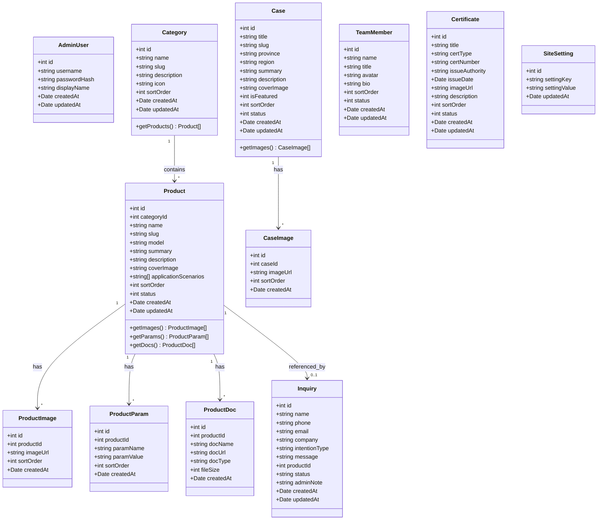
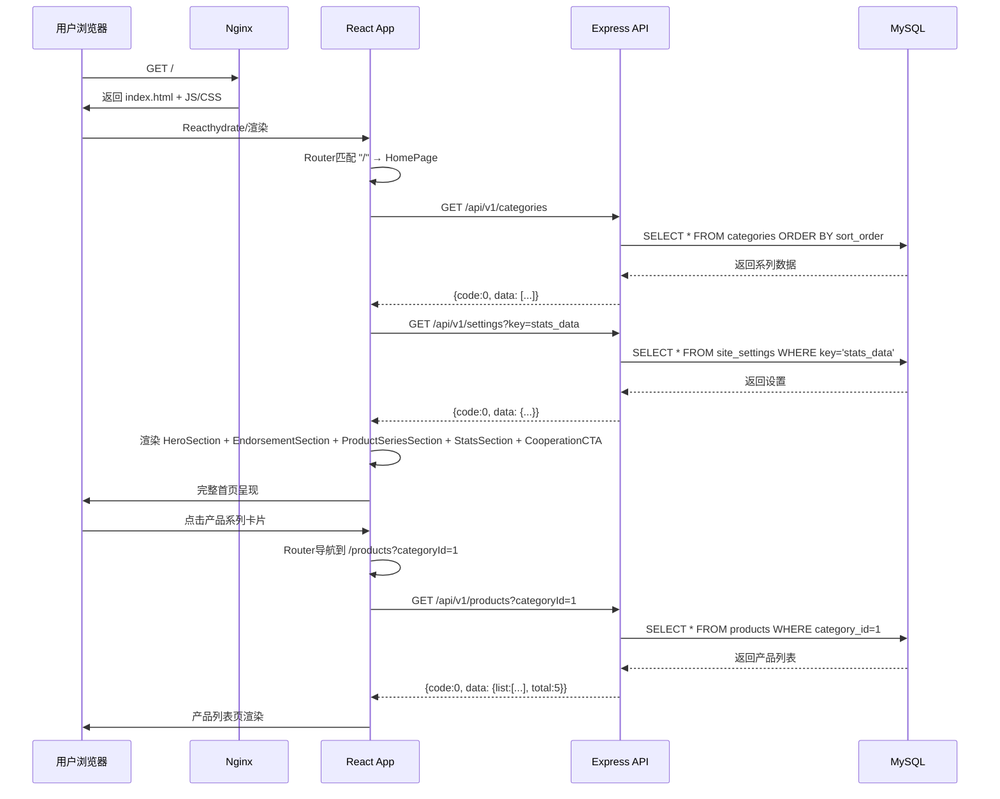
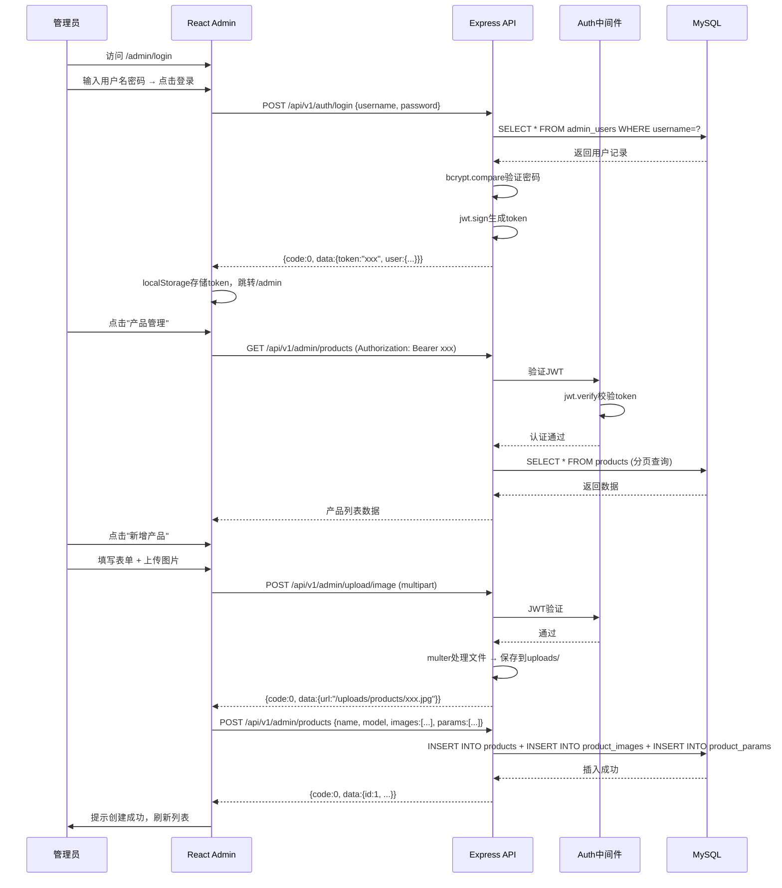
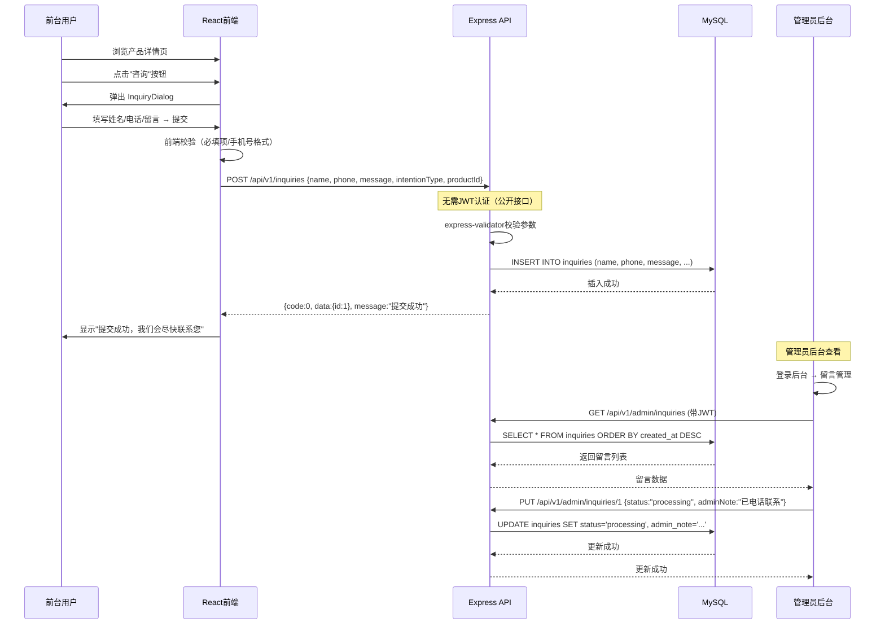
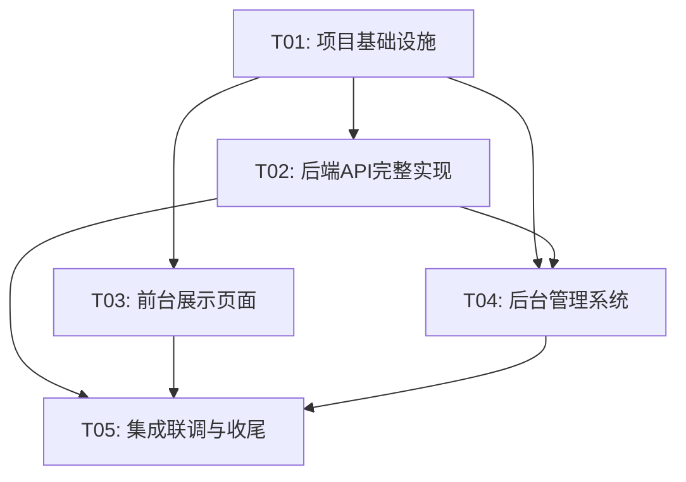

# 杨凌三智科技有限公司门户网站 — 系统架构设计文档

> 版本：v1.0  
> 日期：2026-05-26  
> 架构师：高见远（Gao）

---

## 目录

1. [实现方案与框架选型](#1-实现方案与框架选型)
2. [文件列表及相对路径](#2-文件列表及相对路径)
3. [数据结构与接口](#3-数据结构与接口)
4. [程序调用流程](#4-程序调用流程)
5. [任务列表](#5-任务列表)
6. [依赖包列表](#6-依赖包列表)
7. [共享知识](#7-共享知识)
8. [待明确事项](#8-待明确事项)

---

## 1. 实现方案与框架选型

### 1.1 整体架构

采用**前后端分离**的单体应用架构，适合企业展示型网站：

```
┌─────────────────────────────────────────────────┐
│                    Nginx                         │
│         静态资源托管 + 反向代理API                 │
├──────────────────┬──────────────────────────────┤
│   前端 (React)    │      后端 (Express)          │
│   Vite + MUI     │      RESTful API            │
│   + Tailwind     │      JWT Auth               │
├──────────────────┴──────────────────────────────┤
│              MySQL 8.0                          │
│         本地文件存储 (uploads/)                   │
└─────────────────────────────────────────────────┘
```

### 1.2 前端架构

| 技术 | 选型 | 理由 |
|------|------|------|
| 构建工具 | Vite 5 | 快速HMR，构建性能优秀 |
| UI框架 | React 18 | 组件化开发，生态成熟 |
| 组件库 | MUI 5 | 企业级组件，主题定制能力强 |
| CSS方案 | Tailwind CSS 3 | 原子化CSS，快速布局 |
| 路由 | React Router v6 | 声明式路由，嵌套路由支持 |
| 状态管理 | React Context + useState | 展示型站点，无需Redux |
| HTTP客户端 | Axios | 拦截器支持，请求/响应统一处理 |
| 动画 | Framer Motion | 声明式动画，滚动触发支持好 |
| 地图 | SVG手绘中国地图 | 无API依赖，离线可用，轻量 |
| 富文本 | 无（结构化内容） | 企业展示站用结构化数据，无需富文本 |

**前端路由结构**：
```
/                   → 首页（5屏）
/about              → 关于我们
/products           → 产品中心
/products/:id       → 产品详情
/technology         → 核心技术
/cases              → 应用案例
/cases/:id          → 案例详情
/cooperation        → 合作加盟
/admin/login        → 后台登录
/admin              → 后台首页（仪表盘）
/admin/products     → 产品管理
/admin/cases        → 案例管理
/admin/team         → 团队管理
/admin/certificates → 证书管理
/admin/inquiries    → 留言管理
/admin/settings     → 站点设置
```

### 1.3 后端架构

| 技术 | 选型 | 理由 |
|------|------|------|
| 运行时 | Node.js 18+ LTS | 稳定可靠 |
| 框架 | Express 4 | 轻量简洁，适合展示站，无需NestJS的复杂抽象 |
| 数据库 | MySQL 8.0 | 关系型，适合结构化产品数据 |
| ORM | mysql2 + 手写SQL | 展示站查询简单，无需Sequelize的抽象开销 |
| 认证 | JWT (jsonwebtoken) | 无状态认证，适合单管理员场景 |
| 文件上传 | multer | Express生态标准方案 |
| 文件存储 | 本地 uploads/ 目录 | 初期无需OSS，降低成本 |
| 参数校验 | express-validator | 轻量级请求校验 |
| 密码 | bcryptjs | 安全哈希 |

**后端分层结构**：
```
Controller (路由处理) → Service (业务逻辑) → Model (数据访问)
```

### 1.4 部署架构

```
Nginx (:80/:443)
  ├── /            → 静态文件 (dist/)
  ├── /api/*       → 反向代理 → Node.js (:3000)
  └── /uploads/*   → 静态文件 (uploads/)

PM2 管理 Node.js 进程
```

### 1.5 架构决策记录

| 决策 | 选项 | 选择 | 理由 |
|------|------|------|------|
| 后端框架 | Express vs NestJS | Express | 展示站CRUD为主，无需DI/AOP复杂度 |
| 地图方案 | ECharts地图 vs SVG手绘 | SVG手绘 | 无API依赖，离线可用，体积小 |
| 三方架构视觉 | Tab切换 vs 三列并列 | 三列并列卡片 | 直观清晰，一目了然 |
| 下载留资 | P0下载需留资 vs 直接下载 | P0直接下载 | 降低转化门槛，P1再增加留资 |
| 权限体系 | RBAC vs 单管理员 | 单管理员 | 初期仅需一个管理员，YAGNI |
| 产品参数 | 固定字段 vs 自定义字段 | 自定义字段(系列级) | 5大系列参数差异大，需灵活配置 |
| 状态管理 | Redux vs Context | Context | 展示站状态简单，无需Redux |
| 文件存储 | 阿里云OSS vs 本地 | 本地 | 初期降本，后续可迁移 |

---

## 2. 文件列表及相对路径

### 2.1 项目根目录结构

```
yanglingsanzhi/
├── package.json                  # 前端依赖
├── vite.config.ts                # Vite配置
├── tsconfig.json                 # TypeScript配置
├── tsconfig.node.json            # Node环境TS配置
├── tailwind.config.js            # Tailwind CSS配置
├── postcss.config.js             # PostCSS配置
├── index.html                    # 入口HTML
├── .env                          # 前端环境变量
├── .env.production               # 生产环境变量
├── .gitignore
├── nginx.conf                    # Nginx配置参考
├── ecosystem.config.js           # PM2配置
├── server/                       # 后端代码
├── src/                          # 前端代码
└── public/                       # 静态资源
    ├── favicon.ico
    └── china-map.svg             # 中国地图SVG
```

### 2.2 前端文件列表 (src/)

```
src/
├── main.tsx                              # 应用入口
├── App.tsx                               # 根组件（路由配置）
├── vite-env.d.ts                         # Vite类型声明
│
├── theme/
│   └── theme.ts                          # MUI主题定制（颜色/字体/断点）
│
├── types/
│   ├── product.ts                         # 产品相关类型
│   ├── case.ts                            # 案例相关类型
│   ├── team.ts                            # 团队相关类型
│   ├── certificate.ts                     # 证书相关类型
│   ├── inquiry.ts                         # 留言相关类型
│   ├── admin.ts                           # 管理员相关类型
│   └── api.ts                             # API响应通用类型
│
├── api/
│   ├── client.ts                          # Axios实例（拦截器/基础URL）
│   ├── product.ts                         # 产品API
│   ├── case.ts                            # 案例API
│   ├── team.ts                            # 团队API
│   ├── certificate.ts                     # 证书API
│   ├── inquiry.ts                         # 留言API
│   ├── auth.ts                            # 认证API
│   └── upload.ts                          # 上传API
│
├── hooks/
│   ├── useScrollAnimation.ts              # 滚动动画Hook
│   ├── useCountUp.ts                      # 数字滚动Hook
│   └── useInView.ts                       # 元素可见性检测Hook
│
├── contexts/
│   └── AuthContext.tsx                     # 认证上下文
│
├── components/
│   ├── layout/
│   │   ├── Navbar.tsx                     # 导航栏（吸顶）
│   │   ├── Footer.tsx                     # 页脚
│   │   ├── Layout.tsx                     # 前台布局容器
│   │   └── AdminLayout.tsx                # 后台布局容器
│   │
│   ├── common/
│   │   ├── ScrollToTop.tsx                # 返回顶部
│   │   ├── Breadcrumb.tsx                 # 面包屑导航
│   │   ├── LoadingSpinner.tsx             # 加载动画
│   │   ├── SkeletonCard.tsx               # 骨架屏卡片
│   │   ├── SectionTitle.tsx               # 区块标题组件
│   │   ├── ImageCarousel.tsx              # 图片轮播组件
│   │   ├── InquiryDialog.tsx              # 咨询弹窗
│   │   └── ScrollIndicator.tsx             # 滚动指示器
│   │
│   ├── home/
│   │   ├── HeroSection.tsx                # Hero标语区
│   │   ├── EndorsementSection.tsx         # 三方背书区
│   │   ├── ProductSeriesSection.tsx       # 5大产品系列卡片
│   │   ├── StatsSection.tsx               # 数据滚动动画区
│   │   └── CooperationCTA.tsx             # 合作号召区
│   │
│   ├── product/
│   │   ├── ProductCard.tsx                # 产品卡片
│   │   ├── ProductFilter.tsx              # 产品筛选（按系列）
│   │   ├── ProductGrid.tsx                # 产品网格列表
│   │   ├── ProductDetail.tsx              # 产品详情展示
│   │   └── ParamTable.tsx                 # 技术参数表
│   │
│   ├── technology/
│   │   ├── LabCooperation.tsx             # 实验室合作
│   │   ├── PatentSection.tsx             # 专利证书展示
│   │   └── CertificationSection.tsx       # 认证展示
│   │
│   ├── case/
│   │   ├── ChinaMap.tsx                   # 中国地图（SVG交互）
│   │   ├── CaseCard.tsx                   # 案例卡片
│   │   └── CaseGrid.tsx                   # 案例网格
│   │
│   └── admin/
│       ├── ProtectedRoute.tsx             # 路由守卫
│       ├── DataTable.tsx                  # 通用数据表格
│       ├── ImageUploader.tsx              # 图片上传组件
│       ├── FileUploader.tsx               # 文件上传组件
│       ├── ProductForm.tsx               # 产品编辑表单
│       ├── CaseForm.tsx                   # 案例编辑表单
│       └── TeamMemberForm.tsx             # 团队成员编辑表单
│
├── pages/
│   ├── HomePage.tsx                        # 首页
│   ├── AboutPage.tsx                       # 关于我们
│   ├── ProductListPage.tsx                 # 产品列表页
│   ├── ProductDetailPage.tsx              # 产品详情页
│   ├── TechnologyPage.tsx                  # 核心技术页
│   ├── CaseListPage.tsx                    # 案例列表页
│   ├── CaseDetailPage.tsx                  # 案例详情页
│   ├── CooperationPage.tsx                 # 合作加盟页
│   ├── admin/
│   │   ├── LoginPage.tsx                   # 登录页
│   │   ├── DashboardPage.tsx              # 仪表盘
│   │   ├── ProductAdminPage.tsx           # 产品管理
│   │   ├── CaseAdminPage.tsx              # 案例管理
│   │   ├── TeamAdminPage.tsx              # 团队管理
│   │   ├── CertificateAdminPage.tsx       # 证书管理
│   │   ├── InquiryAdminPage.tsx           # 留言管理
│   │   └── SettingsPage.tsx               # 站点设置
│   └── NotFoundPage.tsx                    # 404页面
│
└── styles/
    └── globals.css                         # 全局样式 + Tailwind指令
```

### 2.3 后端文件列表 (server/)

```
server/
├── package.json                           # 后端依赖
├── .env                                  # 后端环境变量
├── .env.example                          # 环境变量示例
│
├── src/
│   ├── index.js                          # 应用入口（Express启动）
│   ├── app.js                            # Express应用配置
│   │
│   ├── config/
│   │   ├── database.js                   # 数据库连接配置
│   │   └── auth.js                       # JWT密钥配置
│   │
│   ├── middleware/
│   │   ├── auth.js                       # JWT认证中间件
│   │   ├── errorHandler.js              # 全局错误处理
│   │   ├── upload.js                     # multer上传中间件
│   │   └── validate.js                   # 参数校验中间件
│   │
│   ├── routes/
│   │   ├── index.js                      # 路由汇总
│   │   ├── auth.js                       # 认证路由
│   │   ├── product.js                    # 产品路由
│   │   ├── case.js                       # 案例路由
│   │   ├── team.js                        # 团队路由
│   │   ├── certificate.js                # 证书路由
│   │   ├── inquiry.js                    # 留言路由
│   │   └── upload.js                     # 上传路由
│   │
│   ├── controllers/
│   │   ├── authController.js             # 认证控制器
│   │   ├── productController.js          # 产品控制器
│   │   ├── caseController.js             # 案例控制器
│   │   ├── teamController.js             # 团队控制器
│   │   ├── certificateController.js      # 证书控制器
│   │   ├── inquiryController.js          # 留言控制器
│   │   └── uploadController.js           # 上传控制器
│   │
│   ├── services/
│   │   ├── authService.js               # 认证服务
│   │   ├── productService.js             # 产品服务
│   │   ├── caseService.js                # 案例服务
│   │   ├── teamService.js                # 团队服务
│   │   ├── certificateService.js        # 证书服务
│   │   └── inquiryService.js             # 留言服务
│   │
│   └── models/
│       ├── database.js                   # 数据库连接池
│       ├── productModel.js              # 产品数据访问
│       ├── caseModel.js                 # 案例数据访问
│       ├── teamModel.js                 # 团队数据访问
│       ├── certificateModel.js          # 证书数据访问
│       ├── inquiryModel.js              # 留言数据访问
│       └── adminUserModel.js            # 管理员数据访问
│
├── uploads/                              # 文件上传目录
│   ├── products/                         # 产品图片
│   ├── cases/                            # 案例图片
│   ├── team/                             # 团队头像
│   ├── certificates/                     # 证书图片
│   └── docs/                             # 检测报告文档
│
└── scripts/
    ├── init-db.js                        # 数据库初始化（建表）
    └── seed.js                           # 种子数据
```

---

## 3. 数据结构与接口

### 3.1 数据库DDL

```sql
-- ============================================================
-- 杨凌三智门户网站 数据库建表脚本
-- 数据库: yanglingsanzhi (MySQL 8.0, utf8mb4)
-- ============================================================

CREATE DATABASE IF NOT EXISTS yanglingsanzhi
  DEFAULT CHARACTER SET utf8mb4
  DEFAULT COLLATE utf8mb4_unicode_ci;

USE yanglingsanzhi;

-- -----------------------------------------------------------
-- 1. 管理员用户表
-- -----------------------------------------------------------
CREATE TABLE admin_users (
  id INT UNSIGNED AUTO_INCREMENT PRIMARY KEY,
  username VARCHAR(50) NOT NULL UNIQUE COMMENT '登录用户名',
  password_hash VARCHAR(255) NOT NULL COMMENT 'bcrypt密码哈希',
  display_name VARCHAR(50) NOT NULL COMMENT '显示名称',
  created_at DATETIME NOT NULL DEFAULT CURRENT_TIMESTAMP,
  updated_at DATETIME NOT NULL DEFAULT CURRENT_TIMESTAMP ON UPDATE CURRENT_TIMESTAMP
) ENGINE=InnoDB DEFAULT CHARSET=utf8mb4 COLLATE=utf8mb4_unicode_ci COMMENT='管理员用户';

-- -----------------------------------------------------------
-- 2. 产品系列（分类）表
-- -----------------------------------------------------------
CREATE TABLE categories (
  id INT UNSIGNED AUTO_INCREMENT PRIMARY KEY,
  name VARCHAR(100) NOT NULL COMMENT '系列名称，如：智慧节水灌溉系列',
  slug VARCHAR(100) NOT NULL UNIQUE COMMENT 'URL友好标识',
  description TEXT COMMENT '系列简介',
  icon VARCHAR(255) COMMENT '系列图标路径',
  sort_order INT NOT NULL DEFAULT 0 COMMENT '排序权重，越大越靠前',
  created_at DATETIME NOT NULL DEFAULT CURRENT_TIMESTAMP,
  updated_at DATETIME NOT NULL DEFAULT CURRENT_TIMESTAMP ON UPDATE CURRENT_TIMESTAMP
) ENGINE=InnoDB DEFAULT CHARSET=utf8mb4 COLLATE=utf8mb4_unicode_ci COMMENT='产品系列分类';

-- -----------------------------------------------------------
-- 3. 产品表
-- -----------------------------------------------------------
CREATE TABLE products (
  id INT UNSIGNED AUTO_INCREMENT PRIMARY KEY,
  category_id INT UNSIGNED NOT NULL COMMENT '所属系列ID',
  name VARCHAR(200) NOT NULL COMMENT '产品名称',
  slug VARCHAR(200) NOT NULL UNIQUE COMMENT 'URL友好标识',
  model VARCHAR(100) COMMENT '产品型号',
  summary VARCHAR(500) COMMENT '产品概述',
  description TEXT COMMENT '产品详细描述',
  cover_image VARCHAR(255) COMMENT '封面图路径',
  application_scenarios TEXT COMMENT '应用场景JSON数组',
  sort_order INT NOT NULL DEFAULT 0,
  status TINYINT NOT NULL DEFAULT 1 COMMENT '1:上架 0:下架',
  created_at DATETIME NOT NULL DEFAULT CURRENT_TIMESTAMP,
  updated_at DATETIME NOT NULL DEFAULT CURRENT_TIMESTAMP ON UPDATE CURRENT_TIMESTAMP,
  INDEX idx_category (category_id),
  INDEX idx_status (status),
  FOREIGN KEY (category_id) REFERENCES categories(id) ON DELETE RESTRICT
) ENGINE=InnoDB DEFAULT CHARSET=utf8mb4 COLLATE=utf8mb4_unicode_ci COMMENT='产品';

-- -----------------------------------------------------------
-- 4. 产品图片表
-- -----------------------------------------------------------
CREATE TABLE product_images (
  id INT UNSIGNED AUTO_INCREMENT PRIMARY KEY,
  product_id INT UNSIGNED NOT NULL COMMENT '产品ID',
  image_url VARCHAR(255) NOT NULL COMMENT '图片路径',
  sort_order INT NOT NULL DEFAULT 0 COMMENT '排序',
  created_at DATETIME NOT NULL DEFAULT CURRENT_TIMESTAMP,
  INDEX idx_product (product_id),
  FOREIGN KEY (product_id) REFERENCES products(id) ON DELETE CASCADE
) ENGINE=InnoDB DEFAULT CHARSET=utf8mb4 COLLATE=utf8mb4_unicode_ci COMMENT='产品图片';

-- -----------------------------------------------------------
-- 5. 产品参数表（自定义字段：按系列可配）
-- -----------------------------------------------------------
CREATE TABLE product_params (
  id INT UNSIGNED AUTO_INCREMENT PRIMARY KEY,
  product_id INT UNSIGNED NOT NULL COMMENT '产品ID',
  param_name VARCHAR(100) NOT NULL COMMENT '参数名，如：工作压力',
  param_value VARCHAR(255) NOT NULL COMMENT '参数值，如：0.1-0.6MPa',
  sort_order INT NOT NULL DEFAULT 0,
  created_at DATETIME NOT NULL DEFAULT CURRENT_TIMESTAMP,
  INDEX idx_product (product_id),
  FOREIGN KEY (product_id) REFERENCES products(id) ON DELETE CASCADE
) ENGINE=InnoDB DEFAULT CHARSET=utf8mb4 COLLATE=utf8mb4_unicode_ci COMMENT='产品技术参数';

-- -----------------------------------------------------------
-- 6. 产品文档表（检测报告等）
-- -----------------------------------------------------------
CREATE TABLE product_docs (
  id INT UNSIGNED AUTO_INCREMENT PRIMARY KEY,
  product_id INT UNSIGNED NOT NULL COMMENT '产品ID',
  doc_name VARCHAR(200) NOT NULL COMMENT '文档名称',
  doc_url VARCHAR(255) NOT NULL COMMENT '文档文件路径',
  doc_type VARCHAR(50) COMMENT '文档类型，如：检测报告、安装手册',
  file_size INT COMMENT '文件大小(字节)',
  created_at DATETIME NOT NULL DEFAULT CURRENT_TIMESTAMP,
  INDEX idx_product (product_id),
  FOREIGN KEY (product_id) REFERENCES products(id) ON DELETE CASCADE
) ENGINE=InnoDB DEFAULT CHARSET=utf8mb4 COLLATE=utf8mb4_unicode_ci COMMENT='产品文档';

-- -----------------------------------------------------------
-- 7. 应用案例表
-- -----------------------------------------------------------
CREATE TABLE cases (
  id INT UNSIGNED AUTO_INCREMENT PRIMARY KEY,
  title VARCHAR(200) NOT NULL COMMENT '案例标题',
  slug VARCHAR(200) NOT NULL UNIQUE COMMENT 'URL友好标识',
  province VARCHAR(50) COMMENT '所在省份',
  region VARCHAR(50) COMMENT '区域：国内/一带一路',
  summary VARCHAR(500) COMMENT '案例概述',
  description TEXT COMMENT '案例详细描述',
  cover_image VARCHAR(255) COMMENT '封面图',
  is_featured TINYINT NOT NULL DEFAULT 0 COMMENT '是否标杆案例',
  sort_order INT NOT NULL DEFAULT 0,
  status TINYINT NOT NULL DEFAULT 1 COMMENT '1:显示 0:隐藏',
  created_at DATETIME NOT NULL DEFAULT CURRENT_TIMESTAMP,
  updated_at DATETIME NOT NULL DEFAULT CURRENT_TIMESTAMP ON UPDATE CURRENT_TIMESTAMP,
  INDEX idx_province (province),
  INDEX idx_region (region),
  INDEX idx_featured (is_featured)
) ENGINE=InnoDB DEFAULT CHARSET=utf8mb4 COLLATE=utf8mb4_unicode_ci COMMENT='应用案例';

-- -----------------------------------------------------------
-- 8. 案例图片表
-- -----------------------------------------------------------
CREATE TABLE case_images (
  id INT UNSIGNED AUTO_INCREMENT PRIMARY KEY,
  case_id INT UNSIGNED NOT NULL COMMENT '案例ID',
  image_url VARCHAR(255) NOT NULL COMMENT '图片路径',
  sort_order INT NOT NULL DEFAULT 0,
  created_at DATETIME NOT NULL DEFAULT CURRENT_TIMESTAMP,
  INDEX idx_case (case_id),
  FOREIGN KEY (case_id) REFERENCES cases(id) ON DELETE CASCADE
) ENGINE=InnoDB DEFAULT CHARSET=utf8mb4 COLLATE=utf8mb4_unicode_ci COMMENT='案例图片';

-- -----------------------------------------------------------
-- 9. 团队成员表
-- -----------------------------------------------------------
CREATE TABLE team_members (
  id INT UNSIGNED AUTO_INCREMENT PRIMARY KEY,
  name VARCHAR(50) NOT NULL COMMENT '姓名',
  title VARCHAR(100) COMMENT '职位/头衔',
  avatar VARCHAR(255) COMMENT '头像路径',
  bio TEXT COMMENT '简介',
  sort_order INT NOT NULL DEFAULT 0,
  status TINYINT NOT NULL DEFAULT 1 COMMENT '1:显示 0:隐藏',
  created_at DATETIME NOT NULL DEFAULT CURRENT_TIMESTAMP,
  updated_at DATETIME NOT NULL DEFAULT CURRENT_TIMESTAMP ON UPDATE CURRENT_TIMESTAMP
) ENGINE=InnoDB DEFAULT CHARSET=utf8mb4 COLLATE=utf8mb4_unicode_ci COMMENT='团队成员';

-- -----------------------------------------------------------
-- 10. 证书/专利表
-- -----------------------------------------------------------
CREATE TABLE certificates (
  id INT UNSIGNED AUTO_INCREMENT PRIMARY KEY,
  title VARCHAR(200) NOT NULL COMMENT '证书/专利名称',
  cert_type ENUM('patent', 'certification', 'approval', 'other') NOT NULL COMMENT '类型：专利/认证/推广目录/其他',
  cert_number VARCHAR(100) COMMENT '证书编号',
  issue_authority VARCHAR(200) COMMENT '颁发机构',
  issue_date DATE COMMENT '颁发日期',
  image_url VARCHAR(255) COMMENT '证书图片路径',
  description TEXT COMMENT '说明',
  sort_order INT NOT NULL DEFAULT 0,
  status TINYINT NOT NULL DEFAULT 1,
  created_at DATETIME NOT NULL DEFAULT CURRENT_TIMESTAMP,
  updated_at DATETIME NOT NULL DEFAULT CURRENT_TIMESTAMP ON UPDATE CURRENT_TIMESTAMP,
  INDEX idx_type (cert_type)
) ENGINE=InnoDB DEFAULT CHARSET=utf8mb4 COLLATE=utf8mb4_unicode_ci COMMENT='证书与专利';

-- -----------------------------------------------------------
-- 11. 咨询/留言表
-- -----------------------------------------------------------
CREATE TABLE inquiries (
  id INT UNSIGNED AUTO_INCREMENT PRIMARY KEY,
  name VARCHAR(50) NOT NULL COMMENT '联系人姓名',
  phone VARCHAR(20) COMMENT '联系电话',
  email VARCHAR(100) COMMENT '电子邮箱',
  company VARCHAR(200) COMMENT '公司名称',
  intention_type ENUM('partner', 'researcher', 'product', 'other') COMMENT '意向类型：合伙人/科研人员/产品咨询/其他',
  message TEXT NOT NULL COMMENT '留言内容',
  product_id INT UNSIGNED COMMENT '关联产品ID（产品咨询时）',
  status ENUM('pending', 'processing', 'resolved') NOT NULL DEFAULT 'pending' COMMENT '处理状态',
  admin_note TEXT COMMENT '管理员备注',
  created_at DATETIME NOT NULL DEFAULT CURRENT_TIMESTAMP,
  updated_at DATETIME NOT NULL DEFAULT CURRENT_TIMESTAMP ON UPDATE CURRENT_TIMESTAMP,
  INDEX idx_status (status),
  INDEX idx_intention (intention_type),
  FOREIGN KEY (product_id) REFERENCES products(id) ON DELETE SET NULL
) ENGINE=InnoDB DEFAULT CHARSET=utf8mb4 COLLATE=utf8mb4_unicode_ci COMMENT='咨询留言';

-- -----------------------------------------------------------
-- 12. 站点设置表（KV结构，灵活存储）
-- -----------------------------------------------------------
CREATE TABLE site_settings (
  id INT UNSIGNED AUTO_INCREMENT PRIMARY KEY,
  setting_key VARCHAR(100) NOT NULL UNIQUE COMMENT '设置键名',
  setting_value TEXT COMMENT '设置值（JSON或字符串）',
  updated_at DATETIME NOT NULL DEFAULT CURRENT_TIMESTAMP ON UPDATE CURRENT_TIMESTAMP
) ENGINE=InnoDB DEFAULT CHARSET=utf8mb4 COLLATE=utf8mb4_unicode_ci COMMENT='站点设置';

-- -----------------------------------------------------------
-- 初始数据：默认管理员（密码: admin123，需首次登录修改）
-- -----------------------------------------------------------
INSERT INTO admin_users (username, password_hash, display_name)
VALUES ('admin', '$2b$10$placeholder_hash_change_on_deploy', '系统管理员');

-- -----------------------------------------------------------
-- 初始数据：站点默认设置
-- -----------------------------------------------------------
INSERT INTO site_settings (setting_key, setting_value) VALUES
('company_name', '杨凌三智科技有限公司'),
('company_address', '陕西省杨凌示范区'),
('company_phone', ''),
('company_email', ''),
('company_intro', ''),
('hero_title', '智慧水利 节水先锋'),
('hero_subtitle', '专注节水灌溉技术创新与产品研发'),
('stats_data', '{"provinces":20,"products":20,"patents":30,"years":10}'),
('cooperation_title', '携手合作 共创未来'),
('footer_links', '[]');
```

### 3.2 API接口定义

所有API遵循 RESTful 风格，基础路径 `/api/v1`。

#### 3.2.1 通用响应格式

```typescript
// 成功响应
{
  "code": 0,
  "data": T,
  "message": "success"
}

// 分页响应
{
  "code": 0,
  "data": {
    "list": T[],
    "total": number,
    "page": number,
    "pageSize": number
  },
  "message": "success"
}

// 错误响应
{
  "code": number,  // 非0
  "data": null,
  "message": "错误描述"
}
```

#### 3.2.2 认证接口

| 方法 | 路径 | 说明 | 认证 |
|------|------|------|------|
| POST | `/api/v1/auth/login` | 管理员登录 | 否 |
| GET | `/api/v1/auth/profile` | 获取当前用户信息 | 是 |
| PUT | `/api/v1/auth/password` | 修改密码 | 是 |

**POST /api/v1/auth/login**
```
请求：{ "username": "admin", "password": "xxx" }
响应：{ "code": 0, "data": { "token": "jwt_token", "user": { "id": 1, "username": "admin", "displayName": "系统管理员" } }, "message": "success" }
```

#### 3.2.3 产品接口

| 方法 | 路径 | 说明 | 认证 |
|------|------|------|------|
| GET | `/api/v1/products` | 产品列表（分页+筛选） | 否 |
| GET | `/api/v1/products/:id` | 产品详情（含参数/图片/文档） | 否 |
| POST | `/api/v1/admin/products` | 创建产品 | 是 |
| PUT | `/api/v1/admin/products/:id` | 更新产品 | 是 |
| DELETE | `/api/v1/admin/products/:id` | 删除产品 | 是 |

**GET /api/v1/products**
```
查询参数：
  categoryId?: number   // 按系列筛选
  keyword?: string      // 搜索关键词
  page?: number         // 页码，默认1
  pageSize?: number     // 每页数量，默认12

响应：
{
  "code": 0,
  "data": {
    "list": [
      {
        "id": 1,
        "categoryId": 1,
        "categoryName": "智慧节水灌溉系列",
        "name": "智能滴灌控制器",
        "slug": "smart-drip-controller",
        "model": "SK-D001",
        "summary": "...",
        "coverImage": "/uploads/products/cover1.jpg",
        "sortOrder": 100
      }
    ],
    "total": 25,
    "page": 1,
    "pageSize": 12
  }
}
```

**GET /api/v1/products/:id**
```
响应：
{
  "code": 0,
  "data": {
    "id": 1,
    "categoryId": 1,
    "categoryName": "智慧节水灌溉系列",
    "name": "智能滴灌控制器",
    "slug": "smart-drip-controller",
    "model": "SK-D001",
    "summary": "...",
    "description": "详细描述...",
    "coverImage": "/uploads/products/cover1.jpg",
    "applicationScenarios": ["农田灌溉", "温室大棚", "果园"],
    "images": [
      { "id": 1, "imageUrl": "/uploads/products/img1.jpg", "sortOrder": 0 },
      { "id": 2, "imageUrl": "/uploads/products/img2.jpg", "sortOrder": 1 }
    ],
    "params": [
      { "id": 1, "paramName": "工作压力", "paramValue": "0.1-0.6MPa", "sortOrder": 0 },
      { "id": 2, "paramName": "流量范围", "paramValue": "1-50L/h", "sortOrder": 1 }
    ],
    "docs": [
      { "id": 1, "docName": "检测报告", "docUrl": "/uploads/docs/report1.pdf", "docType": "检测报告", "fileSize": 1024000 }
    ]
  }
}
```

#### 3.2.4 系列分类接口

| 方法 | 路径 | 说明 | 认证 |
|------|------|------|------|
| GET | `/api/v1/categories` | 获取所有系列 | 否 |
| GET | `/api/v1/categories/:id` | 系列详情 | 否 |
| POST | `/api/v1/admin/categories` | 创建系列 | 是 |
| PUT | `/api/v1/admin/categories/:id` | 更新系列 | 是 |
| DELETE | `/api/v1/admin/categories/:id` | 删除系列 | 是 |

#### 3.2.5 案例接口

| 方法 | 路径 | 说明 | 认证 |
|------|------|------|------|
| GET | `/api/v1/cases` | 案例列表（分页+筛选） | 否 |
| GET | `/api/v1/cases/:id` | 案例详情 | 否 |
| POST | `/api/v1/admin/cases` | 创建案例 | 是 |
| PUT | `/api/v1/admin/cases/:id` | 更新案例 | 是 |
| DELETE | `/api/v1/admin/cases/:id` | 删除案例 | 是 |

**GET /api/v1/cases**
```
查询参数：
  province?: string    // 按省份筛选
  region?: string      // 按区域筛选：domestic / belt_road
  featured?: boolean   // 仅标杆案例
  page?: number
  pageSize?: number
```

#### 3.2.6 团队接口

| 方法 | 路径 | 说明 | 认证 |
|------|------|------|------|
| GET | `/api/v1/team` | 获取团队成员列表 | 否 |
| POST | `/api/v1/admin/team` | 创建成员 | 是 |
| PUT | `/api/v1/admin/team/:id` | 更新成员 | 是 |
| DELETE | `/api/v1/admin/team/:id` | 删除成员 | 是 |

#### 3.2.7 证书/专利接口

| 方法 | 路径 | 说明 | 认证 |
|------|------|------|------|
| GET | `/api/v1/certificates` | 证书列表（按类型筛选） | 否 |
| POST | `/api/v1/admin/certificates` | 创建证书 | 是 |
| PUT | `/api/v1/admin/certificates/:id` | 更新证书 | 是 |
| DELETE | `/api/v1/admin/certificates/:id` | 删除证书 | 是 |

**GET /api/v1/certificates**
```
查询参数：
  certType?: 'patent' | 'certification' | 'approval' | 'other'
```

#### 3.2.8 留言接口

| 方法 | 路径 | 说明 | 认证 |
|------|------|------|------|
| POST | `/api/v1/inquiries` | 提交留言 | 否 |
| GET | `/api/v1/admin/inquiries` | 留言列表 | 是 |
| PUT | `/api/v1/admin/inquiries/:id` | 更新留言状态 | 是 |
| DELETE | `/api/v1/admin/inquiries/:id` | 删除留言 | 是 |

**POST /api/v1/inquiries**
```
请求：
{
  "name": "张三",
  "phone": "13800138000",
  "email": "zhangsan@example.com",
  "company": "某某公司",
  "intentionType": "partner",
  "message": "想了解合伙人政策",
  "productId": 1   // 可选，产品咨询时填写
}
```

#### 3.2.9 文件上传接口

| 方法 | 路径 | 说明 | 认证 |
|------|------|------|------|
| POST | `/api/v1/admin/upload/image` | 上传图片 | 是 |
| POST | `/api/v1/admin/upload/document` | 上传文档 | 是 |

**POST /api/v1/admin/upload/image**
```
请求：multipart/form-data
  file: 图片文件（支持 jpg/png/webp，最大5MB）

响应：
{
  "code": 0,
  "data": { "url": "/uploads/products/xxx.jpg", "filename": "xxx.jpg" },
  "message": "success"
}
```

#### 3.2.10 站点设置接口

| 方法 | 路径 | 说明 | 认证 |
|------|------|------|------|
| GET | `/api/v1/settings` | 获取公开设置（前端） | 否 |
| GET | `/api/v1/admin/settings` | 获取所有设置 | 是 |
| PUT | `/api/v1/admin/settings` | 批量更新设置 | 是 |

### 3.3 类图（Mermaid）



---

## 4. 程序调用流程

### 4.1 前端页面加载流程



### 4.2 后台内容管理流程



### 4.3 用户咨询提交流程



---

## 5. 任务列表

### 任务概览

| 任务ID | 任务名称 | 优先级 | 依赖 | 涉及文件数 |
|--------|----------|--------|------|-----------|
| T01 | 项目基础设施 | P0 | 无 | 12 |
| T02 | 后端API完整实现 | P0 | T01 | 23 |
| T03 | 前台展示页面 | P0 | T01 | 30 |
| T04 | 后台管理系统 | P0 | T01, T02 | 20 |
| T05 | 集成联调与收尾 | P0 | T02, T03, T04 | 8 |

---

### T01: 项目基础设施

**描述**：搭建前后端项目骨架，配置所有构建工具、依赖声明、入口文件、数据库初始化脚本。确保项目可启动，可构建，数据库可连接。

**涉及文件**：
```
根目录:
  package.json, vite.config.ts, tsconfig.json, tsconfig.node.json,
  tailwind.config.js, postcss.config.js, index.html,
  .env, .env.production, .gitignore, nginx.conf, ecosystem.config.js

server/:
  package.json, .env, .env.example, src/index.js, src/app.js

server/src/config/:
  database.js, auth.js

server/src/middleware/:
  auth.js, errorHandler.js, upload.js, validate.js

server/src/models/:
  database.js

server/src/routes/:
  index.js

server/scripts/:
  init-db.js, seed.js

src/:
  main.tsx, App.tsx, vite-env.d.ts

src/theme/:
  theme.ts

src/styles/:
  globals.css

src/types/:
  api.ts

src/api/:
  client.ts

src/contexts/:
  AuthContext.tsx
```

**依赖**：无

---

### T02: 后端API完整实现

**描述**：实现所有RESTful API端点，包括认证、产品CRUD（含图片/参数/文档子资源）、案例CRUD、团队CRUD、证书CRUD、留言管理、文件上传、站点设置。包含所有Controller、Service、Model层代码。

**涉及文件**：
```
server/src/routes/:
  auth.js, product.js, case.js, team.js, certificate.js, inquiry.js, upload.js

server/src/controllers/:
  authController.js, productController.js, caseController.js,
  teamController.js, certificateController.js, inquiryController.js, uploadController.js

server/src/services/:
  authService.js, productService.js, caseService.js,
  teamService.js, certificateService.js, inquiryService.js

server/src/models/:
  productModel.js, caseModel.js, teamModel.js,
  certificateModel.js, inquiryModel.js, adminUserModel.js
```

**依赖**：T01

---

### T03: 前台展示页面

**描述**：实现所有前台展示页面和组件，包括首页5屏、关于我们、产品中心（列表+详情）、核心技术、应用案例（含SVG地图）、合作加盟。所有自定义Hook、通用组件、页面组件。

**涉及文件**：
```
src/types/:
  product.ts, case.ts, team.ts, certificate.ts, inquiry.ts, admin.ts

src/api/:
  product.ts, case.ts, team.ts, certificate.ts, inquiry.ts, auth.ts, upload.ts

src/hooks/:
  useScrollAnimation.ts, useCountUp.ts, useInView.ts

src/components/layout/:
  Navbar.tsx, Footer.tsx, Layout.tsx, AdminLayout.tsx

src/components/common/:
  ScrollToTop.tsx, Breadcrumb.tsx, LoadingSpinner.tsx, SkeletonCard.tsx,
  SectionTitle.tsx, ImageCarousel.tsx, InquiryDialog.tsx, ScrollIndicator.tsx

src/components/home/:
  HeroSection.tsx, EndorsementSection.tsx, ProductSeriesSection.tsx,
  StatsSection.tsx, CooperationCTA.tsx

src/components/product/:
  ProductCard.tsx, ProductFilter.tsx, ProductGrid.tsx,
  ProductDetail.tsx, ParamTable.tsx

src/components/technology/:
  LabCooperation.tsx, PatentSection.tsx, CertificationSection.tsx

src/components/case/:
  ChinaMap.tsx, CaseCard.tsx, CaseGrid.tsx

src/pages/:
  HomePage.tsx, AboutPage.tsx, ProductListPage.tsx, ProductDetailPage.tsx,
  TechnologyPage.tsx, CaseListPage.tsx, CaseDetailPage.tsx,
  CooperationPage.tsx, NotFoundPage.tsx
```

**依赖**：T01

---

### T04: 后台管理系统

**描述**：实现后台管理系统的所有页面和组件，包括登录页、仪表盘、产品管理、案例管理、团队管理、证书管理、留言管理、站点设置。包含路由守卫、数据表格、表单组件、图片/文件上传组件。

**涉及文件**：
```
src/components/admin/:
  ProtectedRoute.tsx, DataTable.tsx, ImageUploader.tsx, FileUploader.tsx,
  ProductForm.tsx, CaseForm.tsx, TeamMemberForm.tsx

src/pages/admin/:
  LoginPage.tsx, DashboardPage.tsx, ProductAdminPage.tsx,
  CaseAdminPage.tsx, TeamAdminPage.tsx, CertificateAdminPage.tsx,
  InquiryAdminPage.tsx, SettingsPage.tsx
```

**依赖**：T01, T02

---

### T05: 集成联调与收尾

**描述**：前后端集成联调，修复对接问题，添加SEO meta标签，性能优化（图片懒加载、代码分割），部署配置验证，最终测试通过。

**涉及文件**：
```
index.html (SEO meta)
vite.config.ts (代理配置调整)
server/src/index.js (CORS/静态文件配置)
nginx.conf (生产配置优化)
ecosystem.config.js (PM2配置)
public/china-map.svg
public/favicon.ico
README相关
```

**依赖**：T02, T03, T04

---

### 任务依赖图



> T02和T03可并行开发（仅依赖T01），T04依赖T01+T02，T05等所有模块完成后集成。

---

## 6. 依赖包列表

### 6.1 前端 package.json

```json
{
  "name": "yanglingsanzhi-portal",
  "private": true,
  "version": "1.0.0",
  "type": "module",
  "scripts": {
    "dev": "vite",
    "build": "tsc && vite build",
    "preview": "vite preview",
    "lint": "eslint . --ext ts,tsx --report-unused-disable-directives --max-warnings 0"
  },
  "dependencies": {
    "react": "^18.2.0",
    "react-dom": "^18.2.0",
    "react-router-dom": "^6.20.0",
    "@mui/material": "^5.14.0",
    "@mui/icons-material": "^5.14.0",
    "@emotion/react": "^11.11.0",
    "@emotion/styled": "^11.11.0",
    "axios": "^1.6.0",
    "framer-motion": "^10.16.0"
  },
  "devDependencies": {
    "@types/react": "^18.2.0",
    "@types/react-dom": "^18.2.0",
    "@vitejs/plugin-react": "^4.2.0",
    "typescript": "^5.3.0",
    "vite": "^5.0.0",
    "tailwindcss": "^3.3.0",
    "postcss": "^8.4.0",
    "autoprefixer": "^10.4.0",
    "eslint": "^8.55.0",
    "@typescript-eslint/eslint-plugin": "^6.0.0",
    "@typescript-eslint/parser": "^6.0.0",
    "eslint-plugin-react-hooks": "^4.6.0",
    "eslint-plugin-react-refresh": "^0.4.0"
  }
}
```

### 6.2 后端 server/package.json

```json
{
  "name": "yanglingsanzhi-server",
  "private": true,
  "version": "1.0.0",
  "type": "module",
  "scripts": {
    "start": "node src/index.js",
    "dev": "node --watch src/index.js",
    "init-db": "node scripts/init-db.js",
    "seed": "node scripts/seed.js"
  },
  "dependencies": {
    "express": "^4.18.2",
    "mysql2": "^3.6.0",
    "jsonwebtoken": "^9.0.2",
    "bcryptjs": "^2.4.3",
    "multer": "^1.4.5-lts.1",
    "express-validator": "^7.0.1",
    "cors": "^2.8.5",
    "dotenv": "^16.3.0",
    "helmet": "^7.1.0",
    "morgan": "^1.10.0",
    "uuid": "^9.0.0"
  },
  "devDependencies": {
    "nodemon": "^3.0.0"
  }
}
```

---

## 7. 共享知识

### 7.1 API响应格式约定

```
成功：{ code: 0, data: T, message: "success" }
分页：{ code: 0, data: { list: T[], total: number, page: number, pageSize: number }, message: "success" }
失败：{ code: non-zero, data: null, message: "错误描述" }
```

### 7.2 错误码约定

| 错误码 | 含义 |
|--------|------|
| 0 | 成功 |
| 10001 | 参数校验失败 |
| 10002 | 资源未找到 |
| 20001 | 认证失败（未登录） |
| 20002 | Token过期 |
| 30001 | 重复数据（唯一约束冲突） |
| 40001 | 文件上传失败 |
| 50001 | 服务器内部错误 |

### 7.3 文件上传约定

| 类型 | 允许格式 | 最大大小 | 存储路径 |
|------|----------|----------|----------|
| 产品图片 | jpg/png/webp | 5MB | uploads/products/ |
| 案例图片 | jpg/png/webp | 5MB | uploads/cases/ |
| 团队头像 | jpg/png/webp | 2MB | uploads/team/ |
| 证书图片 | jpg/png/webp | 5MB | uploads/certificates/ |
| 检测报告 | pdf | 20MB | uploads/docs/ |

文件命名规则：`{uuid}.{ext}`，避免中文路径问题。

### 7.4 路由约定

- 前台路由：全小写，连字符分隔，如 `/products`, `/product-list`, `/about`
- 后台路由：统一 `/admin/` 前缀
- API路由：统一 `/api/v1/` 前缀
- 管理类API：统一 `/api/v1/admin/` 前缀，需要JWT认证
- 公开API：无需认证，如产品列表、案例列表

### 7.5 环境变量约定

**前端 (.env)**：
```
VITE_API_BASE_URL=http://localhost:3000/api/v1
VITE_APP_TITLE=杨凌三智科技有限公司
```

**后端 (server/.env)**：
```
PORT=3000
DB_HOST=localhost
DB_PORT=3306
DB_USER=root
DB_PASSWORD=your_password
DB_NAME=yanglingsanzhi
JWT_SECRET=your_jwt_secret_key
JWT_EXPIRES_IN=24h
UPLOAD_DIR=uploads
MAX_FILE_SIZE=5242880
```

### 7.6 跨域配置

开发环境：Vite dev server 代理 `/api` → `http://localhost:3000`  
生产环境：Nginx 反向代理 `/api` → Node.js

### 7.7 主题色变量

```typescript
// MUI Theme
palette: {
  primary: { main: '#1A3A5C' },     // 深蓝
  secondary: { main: '#E8912B' },   // 橙色
  success: { main: '#2E7D32' },     // 生态绿
  background: { default: '#F5F5F5' }
}
```

### 7.8 数据库约定

- 主键：`id INT UNSIGNED AUTO_INCREMENT`
- 时间字段：`created_at DATETIME DEFAULT CURRENT_TIMESTAMP`, `updated_at DATETIME DEFAULT CURRENT_TIMESTAMP ON UPDATE CURRENT_TIMESTAMP`
- 软删除：不使用，直接物理删除（展示站数据量小）
- 字符集：utf8mb4_unicode_ci
- 引擎：InnoDB

---

## 8. 待明确事项

| # | 事项 | 当前假设 | 影响范围 | 建议 |
|---|------|----------|----------|------|
| 1 | 首页统计数字数据来源 | 硬编码在site_settings中，后台可编辑 | StatsSection | 后期可接入真实数据源 |
| 2 | 中国地图省份点击交互 | SVG地图+hover高亮，点击筛选案例 | ChinaMap组件 | 已选SVG方案，无API依赖 |
| 3 | 产品对比功能（P1） | P0不实现，预留数据结构 | ProductFilter | P1迭代时扩展 |
| 4 | 在线加盟申请（P1） | P0仅留言表单，P1增加正式申请流程 | CooperationPage | P1迭代 |
| 5 | SEO需求细节 | 静态meta标签+动态页面title | index.html, 各页面 | 可后续接入SSR |
| 6 | 多管理员需求 | 初期单管理员，admin_users表支持多用户 | 后台管理 | 表结构已支持，后续可扩展 |
| 7 | 产品参数模板 | 每个产品独立配参数，无系列级模板 | ProductParam | 简单灵活，后续可加模板功能 |
| 8 | 检测报告下载是否需要留资 | P0直接下载，P1可考虑留资 | 产品详情页 | 降低用户门槛 |
| 9 | 农创汇入驻详情 | 暂作为展示内容，使用site_settings配置 | AboutPage | 待运营提供具体内容 |
| 10 | 一带一路案例展示 | 与国内案例同一表，region字段区分 | CaseListPage | 支持筛选展示 |

---

> **文档结束** — 本架构设计文档将指导工程师按T01→T02/T03(并行)→T04→T05的顺序实现系统。
