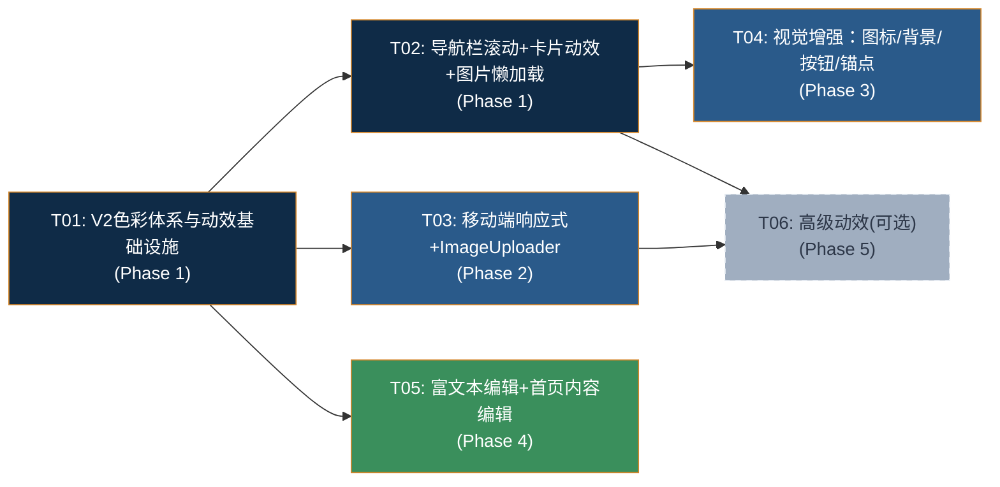
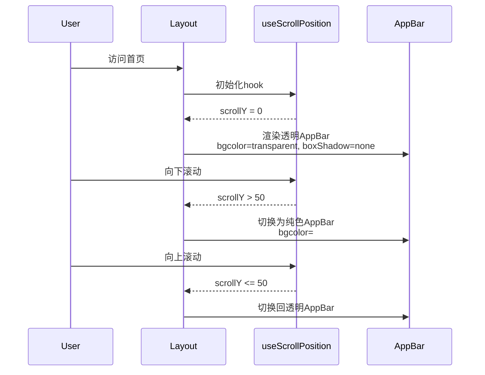
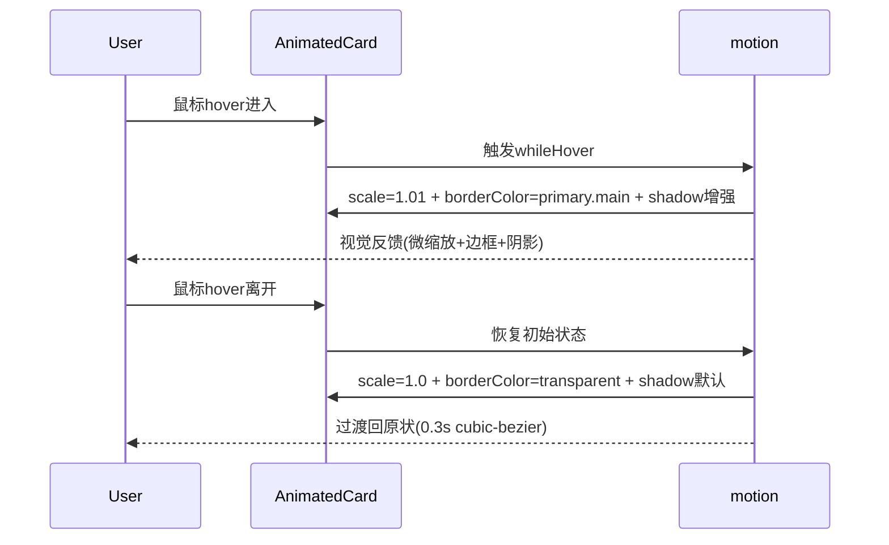
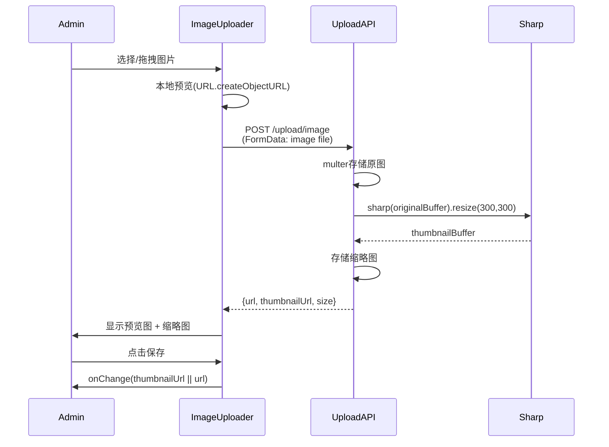

# 杨凌三智官网V2 — 系统架构设计 & 任务分解

> 架构师：高见远（Gao）  
> 版本：v2.0  
> 日期：2026-05-26  

---

## 1. 实现方案概述

### 1.1 改造策略

本方案采用**增量改造**策略，不重写项目，基于V1现有代码逐模块升级：

- **色彩先行**：统一替换V1→V2色彩体系，作为全局基础，后续所有改造均基于新色彩
- **动效渐进**：从基础hover→过渡动画→高级毛玻璃，分3层递进
- **组件抽离**：将散落在各页面的重复逻辑（硬编码颜色、动效参数）抽离为共享常量/组件
- **后台增强**：ImageUploader组件统一替换、富文本编辑器集成，不影响前台

### 1.2 核心技术挑战

| 挑战 | 说明 | 方案 |
|------|------|------|
| 色彩全局替换 | V1硬编码颜色散布在15+文件中 | 创建`src/theme/colors.ts`统一色彩常量，theme.ts和tailwind同步更新，页面逐文件替换 |
| 导航栏滚动效果 | 需监听scroll事件，透明→纯色渐变 | 自定义hook `useScrollPosition`，AppBar + sx动态切换 |
| 汉堡菜单动画 | V1 Drawer无过渡动画 | 使用framer-motion `AnimatePresence` + 滑入动画 |
| 图片懒加载 | 原生`loading="lazy"` + 首屏preload | 统一封装`LazyImage`组件，包含占位骨架屏 |
| ImageUploader | 后台多页面上传逻辑不统一 | 抽取共享组件，含缩略图生成(sharp) |
| 富文本编辑 | 5个字段需切换为富文本 | react-quill集成，封装`RichTextEditor`组件 |
| 锚点导航 | 首页板块id + URL hash同步 | `useNavigate` + `hash` + `scrollIntoView` |

### 1.3 架构模式

沿用V1的 **React SPA + REST API** 架构，不引入新架构模式。前端保持 MUI + Tailwind 混合样式方案。

---

## 2. 文件变更清单

### 2.1 新建文件

| 操作 | 文件路径 | 变更说明 |
|------|----------|----------|
| 新建 | `src/theme/colors.ts` | V2色彩常量定义，供theme/tailwind/组件统一引用 |
| 新建 | `src/theme/motion.ts` | 动效参数常量（过渡曲线、缩放比例、时长等） |
| 新建 | `src/hooks/useScrollPosition.ts` | 滚动位置监听hook，导航栏效果用 |
| 新建 | `src/hooks/useHashNavigation.ts` | 锚点导航hook，URL hash同步 |
| 新建 | `src/components/LazyImage.tsx` | 图片懒加载组件（loading="lazy" + 骨架屏 + preload支持） |
| 新建 | `src/components/ImageUploader.tsx` | 后台统一图片上传组件（含预览、缩略图） |
| 新建 | `src/components/RichTextEditor.tsx` | 富文本编辑器组件（react-quill封装） |
| 新建 | `src/components/SectionDecorator.tsx` | 板块背景装饰组件（科技底纹+渐变） |
| 新建 | `src/components/AnimatedCard.tsx` | 统一卡片hover动效组件（替代各页面重复hover sx） |
| 新建 | `src/components/MobileDrawer.tsx` | 移动端汉堡菜单（framer-motion动画版） |
| 新建 | `src/components/ProvinceList.tsx` | 省份分组列表组件（移动端替代地图） |
| 新建 | `server/src/routes/upload.ts`（改造） | 新增缩略图生成端点 POST /upload/thumbnail |

### 2.2 修改文件

| 操作 | 文件路径 | 变更说明 |
|------|----------|----------|
| 修改 | `src/theme/theme.ts` | V2色彩替换primary/secondary/success/background |
| 修改 | `tailwind.config.js` | V2色彩替换 + 新增中性色阶(文字灰/分割线) |
| 修改 | `src/components/Layout.tsx` | 导航栏滚动效果 + 汉堡菜单替换 + 色彩替换 |
| 修改 | `src/components/HeroSection.tsx` | V2渐变色 + 色彩替换 |
| 修改 | `src/components/SectionTitle.tsx` | 装饰线增强 + 色彩替换 |
| 修改 | `src/pages/HomePage.tsx` | 卡片动效替换 + emoji→MUI Icon + 色彩替换 + 锚点id |
| 修改 | `src/pages/AboutPage.tsx` | 卡片动效 + 色彩替换 + LazyImage |
| 修改 | `src/pages/ProductsPage.tsx` | 卡片动效 + 色彩替换 + LazyImage + emoji→Icon |
| 修改 | `src/pages/CasesPage.tsx` | 卡片动效 + 色彩替换 + 移动端省份列表 + LazyImage |
| 修改 | `src/pages/TechnologyPage.tsx` | 卡片动效 + 色彩替换 + LazyImage |
| 修改 | `src/pages/CooperationPage.tsx` | 卡片动效 + 色彩替换 + 按钮hover增强 |
| 修改 | `src/pages/ProductDetailPage.tsx` | 色彩替换 + LazyImage |
| 修改 | `src/pages/CaseDetailPage.tsx` | 色彩替换 + LazyImage |
| 修改 | `src/pages/admin/AdminProducts.tsx` | ImageUploader替换 + RichTextEditor + 色彩替换 |
| 修改 | `src/pages/admin/AdminCases.tsx` | ImageUploader替换 + RichTextEditor + 色彩替换 |
| 修改 | `src/pages/admin/AdminTeam.tsx` | ImageUploader替换 + 色彩替换 |
| 修改 | `src/pages/admin/AdminCertificates.tsx` | ImageUploader替换 + 色彩替换 |
| 修改 | `src/pages/admin/AdminSettings.tsx` | 首页内容编辑JSON字段 + 色彩替换 |
| 修改 | `src/App.tsx` | Loading色彩替换 |
| 修改 | `src/api/settings.ts` | 新增首页内容CRUD API调用 |
| 修改 | `src/types/api.ts` | 新增HomePageContent类型定义 |
| 修改 | `server/src/routes/settings.js` | 新增首页内容JSON字段的读写支持 |
| 修改 | `server/src/routes/upload.js` | 新增缩略图生成端点 |
| 修改 | `server/src/middleware/upload.js` | 文件大小限制调整(5MB→10MB) |
| 修改 | `package.json` | 新增react-quill, sharp等依赖 |

---

## 3. 数据结构变更

### 3.1 site_settings 表新增 key

不新增数据库表，利用现有 `site_settings` 表的 key-value 结构存储首页可编辑内容：

| setting_key | 说明 | 值格式 |
|-------------|------|--------|
| `home_hero_title` | 首页Hero主标题 | string |
| `home_hero_subtitle` | 首页Hero副标题 | string |
| `home_endorse_section` | 三方背书板块内容 | JSON string |
| `home_data_section` | 数据背书板块内容 | JSON string |
| `home_cta_title` | 合作号召标题 | string |
| `home_cta_subtitle` | 合作号召副标题 | string |

`home_endorse_section` JSON结构示例：
```json
[
  { "title": "水土保持与荒漠化整治全国重点实验室", "subtitle": "技术源头·国家智库", "desc": "..." },
  { "title": "西安三智科技", "subtitle": "14年深耕·产品制造", "desc": "..." },
  { "title": "杨凌农创汇×水务局", "subtitle": "在地转化·政策赋能", "desc": "..." }
]
```

`home_data_section` JSON结构示例：
```json
[
  { "end": 22, "suffix": "+", "label": "专利技术" },
  { "end": 5, "suffix": "大", "label": "产品系列" },
  { "end": 20, "suffix": "+", "label": "省份推广" },
  { "end": 1, "suffix": "", "label": "CMA 权威认证" }
]
```

### 3.2 新增API端点

| 方法 | 端点 | 说明 | 认证 |
|------|------|------|------|
| POST | `/upload/thumbnail` | 上传图片并生成缩略图 | 需要 |
| GET | `/settings/group/home` | 获取首页内容分组设置 | 公开 |

> 注：`/settings/group/home` 只是 `GET /settings` 的便捷封装，按 `home_` 前缀过滤返回。也可直接复用现有 `GET /settings` 在前端过滤，不新增端点。

### 3.3 TypeScript 类型新增

```typescript
// src/types/api.ts 新增

export interface HomeEndorseItem {
  title: string;
  subtitle: string;
  desc: string;
}

export interface HomeDataItem {
  end: number;
  suffix: string;
  label: string;
}

export interface HomePageContent {
  hero_title: string;
  hero_subtitle: string;
  endorse_section: HomeEndorseItem[];
  data_section: HomeDataItem[];
  cta_title: string;
  cta_subtitle: string;
}
```

---

## 4. 组件架构

### 4.1 新增组件列表

| 组件 | 文件路径 | 职责 |
|------|----------|------|
| `LazyImage` | `src/components/LazyImage.tsx` | 图片懒加载：loading="lazy"、骨架屏占位、首屏preload支持、加载错误兜底 |
| `ImageUploader` | `src/components/ImageUploader.tsx` | 后台统一图片上传：拖拽上传、预览、缩略图生成、删除 |
| `RichTextEditor` | `src/components/RichTextEditor.tsx` | 富文本编辑器：react-quill封装、自定义toolbar、图片插入、HTML输出 |
| `SectionDecorator` | `src/components/SectionDecorator.tsx` | 板块背景装饰：SVG科技底纹、渐变过渡、支持方向参数 |
| `AnimatedCard` | `src/components/AnimatedCard.tsx` | 统一卡片动效：hover边框色变化、微缩放1.01、过渡曲线优化、framer-motion集成 |
| `MobileDrawer` | `src/components/MobileDrawer.tsx` | 移动端汉堡菜单：framer-motion滑入动画、触控友好≥44px、遮罩层 |
| `ProvinceList` | `src/components/ProvinceList.tsx` | 省份分组列表：移动端替代地图、按省份分组展示案例、点击展开 |
| `SectionTitle`(增强) | `src/components/SectionTitle.tsx` | 增加装饰线增强模式：渐变色装饰线、两侧扩展线 |

### 4.2 新增Hooks

| Hook | 文件路径 | 职责 |
|------|----------|------|
| `useScrollPosition` | `src/hooks/useScrollPosition.ts` | 监听scroll事件，返回scrollY，用于导航栏透明→纯色切换 |
| `useHashNavigation` | `src/hooks/useHashNavigation.ts` | 监听URL hash变化，平滑滚动到锚点；点击导航时更新hash |

### 4.3 现有组件改造要点

| 组件 | 改造要点 |
|------|----------|
| `Layout` | AppBar透明→纯色滚动效果(首页)、MobileDrawer替换Drawer、V2色彩 |
| `HeroSection` | V2渐变色 `#0F2B47→#1E4D73`、按钮hover增强 |
| `SectionTitle` | 装饰线渐变色、新增扩展线装饰、V2色彩 |
| `CountUpNumber` | 无需改动 |
| `InquiryDialog` | V2色彩替换 |
| `ScrollToTop` | 无需改动 |

### 4.4 组件依赖关系图

```mermaid
graph TD
    subgraph 基础层
        Colors["theme/colors.ts<br/>V2色彩常量"]
        Motion["theme/motion.ts<br/>动效参数"]
    end

    subgraph Hooks层
        ScrollHook["useScrollPosition"]
        HashHook["useHashNavigation"]
    end

    subgraph 通用组件层
        LazyImg["LazyImage"]
        AniCard["AnimatedCard"]
        SecDec["SectionDecorator"]
        SecTitle["SectionTitle<br/>(增强)"]
    end

    subgraph 移动端组件
        MobDrawer["MobileDrawer"]
        ProvList["ProvinceList"]
    end

    subgraph 后台组件
        ImgUploader["ImageUploader"]
        RichEditor["RichTextEditor"]
    end

    subgraph 页面层
        Layout["Layout"]
        HomePage["HomePage"]
        AboutPage["AboutPage"]
        ProductsPage["ProductsPage"]
        CasesPage["CasesPage"]
        TechPage["TechnologyPage"]
        CoopPage["CooperationPage"]
        AdminProducts["AdminProducts"]
        AdminCases["AdminCases"]
        AdminTeam["AdminTeam"]
        AdminCerts["AdminCertificates"]
        AdminSettings["AdminSettings"]
    end

    Colors --> Layout
    Colors --> HomePage
    Colors --> AniCard
    Colors --> SecTitle
    Motion --> AniCard
    Motion --> MobDrawer

    ScrollHook --> Layout
    HashHook --> HomePage
    LazyImg --> HomePage
    LazyImg --> ProductsPage
    LazyImg --> CasesPage
    LazyImg --> TechPage

    AniCard --> HomePage
    AniCard --> AboutPage
    AniCard --> ProductsPage
    AniCard --> CasesPage
    AniCard --> TechPage

    SecDec --> HomePage
    SecDec --> AboutPage
    SecDec --> ProductsPage
    SecTitle --> HomePage
    SecTitle --> AboutPage
    SecTitle --> ProductsPage
    SecTitle --> CasesPage
    SecTitle --> TechPage
    SecTitle --> CoopPage

    MobDrawer --> Layout
    ProvList --> CasesPage

    ImgUploader --> AdminProducts
    ImgUploader --> AdminCases
    ImgUploader --> AdminTeam
    ImgUploader --> AdminCerts
    RichEditor --> AdminProducts
    RichEditor --> AdminCases
    RichEditor --> AdminSettings
```



---

## 5. 任务列表

### Phase 1：色彩与基础（P0-01, P0-02, P0-03, P0-04）

#### T01：V2色彩体系 + 动效常量 + 主题配置

| 项目 | 内容 |
|------|------|
| 任务编号 | T01 |
| 任务名称 | V2色彩体系与动效基础设施 |
| 涉及文件 | `src/theme/colors.ts`(新), `src/theme/motion.ts`(新), `src/theme/theme.ts`(改), `tailwind.config.js`(改), `src/App.tsx`(改) |
| 依赖 | 无 |
| 预估复杂度 | M |
| 具体步骤 | 1. 创建 `colors.ts`：定义V2完整色彩常量（primary/secondary/success/background + 新增中性色阶textDark/textMedium/textLight/divider）<br/>2. 创建 `motion.ts`：定义动效参数常量（HOVER_SCALE=1.01, CARD_HOVER_SCALE=1.01, BTN_HOVER_SCALE=1.03, TRANSITION_EASE, TRANSITION_DURATION, SCROLL_THRESHOLD=50 等）<br/>3. 改造 `theme.ts`：import colors替换palette中primary.main=#0F2B47, primary.light=#2A5A8A, primary.dark=#081B30, secondary.main=#D4862A, secondary.light=#E09A3F, secondary.dark=#B86F1F, success.main=#3A8F5C, success.light=#6BB87E, success.dark=#2A6B42, background.default=#F8F9FC；新增textDark/textMedium/textLight/divider色阶<br/>4. 改造 `tailwind.config.js`：同步V2色彩值，新增textDark(#2D3748)、textMedium(#718096)、textLight(#A0AEC0)、divider(#E2E8F0)色阶<br/>5. 改造 `App.tsx`：Loading组件的CircularProgress颜色从#1A3A5C改为引用theme primary |

#### T02：导航栏滚动效果 + 卡片动效组件 + 图片懒加载

| 项目 | 内容 |
|------|------|
| 任务编号 | T02 |
| 任务名称 | 导航栏滚动、卡片动效、图片懒加载 |
| 涉及文件 | `src/hooks/useScrollPosition.ts`(新), `src/components/AnimatedCard.tsx`(新), `src/components/LazyImage.tsx`(新), `src/components/Layout.tsx`(改), `src/components/HeroSection.tsx`(改) |
| 依赖 | T01 |
| 预估复杂度 | L |
| 具体步骤 | 1. 创建 `useScrollPosition.ts`：使用useState+useEffect监听window scroll，返回scrollY数值，用requestAnimationFrame节流<br/>2. 创建 `AnimatedCard.tsx`：封装MUI Card + framer-motion，props: `hoverScale`(默认1.01)、`hoverBorderColor`(默认primary.main)、`enableBorderAnim`(默认true)、`children`。hover时边框色变化+微缩放+box-shadow增强，过渡曲线使用motion.ts中的TRANSITION_EASE<br/>3. 创建 `LazyImage.tsx`：封装Box+img，props: `src`、`alt`、`width`、`height`、`preload`(默认false)、`objectFit`、`sx`。preload时添加`<link rel="preload">`，非preload时`loading="lazy"`，加载中显示Skeleton，加载失败显示占位图标<br/>4. 改造 `Layout.tsx`：首页AppBar使用useScrollPosition，scrollY>SCROLL_THRESHOLD时从透明(bgcolor: 'transparent', boxShadow: 'none')切换到纯色(bgcolor: primary.main, boxShadow: 2)，非首页保持纯色；所有V1硬编码色值替换为V2；Footer的#1A3A5C替换<br/>5. 改造 `HeroSection.tsx`：渐变色从#1A3A5C→#2E6B9E替换为#0F2B47→#1E4D73；按钮hover增强(scale 1.03)；装饰圆的颜色微调 |

---

### Phase 2：响应式与后台（P0-05, P0-06）

#### T03：移动端响应式 + 后台图片上传组件

| 项目 | 内容 |
|------|------|
| 任务编号 | T03 |
| 任务名称 | 移动端响应式完善 + 后台ImageUploader |
| 涉及文件 | `src/components/MobileDrawer.tsx`(新), `src/components/ProvinceList.tsx`(新), `src/components/ImageUploader.tsx`(新), `src/components/Layout.tsx`(改), `src/pages/CasesPage.tsx`(改), `src/pages/admin/AdminProducts.tsx`(改), `src/pages/admin/AdminCases.tsx`(改), `src/pages/admin/AdminTeam.tsx`(改), `src/pages/admin/AdminCertificates.tsx`(改), `server/src/routes/upload.js`(改), `server/src/middleware/upload.js`(改) |
| 依赖 | T01 |
| 预估复杂度 | L |
| 具体步骤 | 1. 创建 `MobileDrawer.tsx`：用framer-motion AnimatePresence实现右侧滑入动画(duration:0.3, ease:easeOut)；菜单项高度≥44px；遮罩层点击关闭；V2色彩<br/>2. 创建 `ProvinceList.tsx`：移动端替代地图视图，按省份分组展示案例列表，点击展开/折叠，V2色彩<br/>3. 创建 `ImageUploader.tsx`：封装上传逻辑，props: `value`(当前URL)、`onChange`(回调)、`label`、`accept`(默认image/*)。功能：点击上传/拖拽上传、实时预览、缩略图生成(调用/upload/thumbnail)、删除按钮；内部使用client.post('/upload/image')<br/>4. 改造 `Layout.tsx`：替换Drawer为MobileDrawer组件；移动端触控区域≥44px验证<br/>5. 改造 `CasesPage.tsx`：移动端(md down)隐藏地图区域，显示ProvinceList组件替代<br/>6. 改造后台4个Admin页面：统一替换图片上传为ImageUploader组件<br/>7. 改造 `server/src/routes/upload.js`：新增 POST /upload/thumbnail 端点，使用sharp生成缩略图(max 300x300)返回{url, thumbnailUrl}<br/>8. 改造 `server/src/middleware/upload.js`：文件大小限制从5MB调整为10MB |

---

### Phase 3：视觉增强（P1-01, P1-02, P1-03, P1-04）

#### T04：图标升级 + 背景装饰 + 按钮增强 + 锚点导航

| 项目 | 内容 |
|------|------|
| 任务编号 | T04 |
| 任务名称 | 视觉增强：图标/背景/按钮/锚点 |
| 涉及文件 | `src/components/SectionDecorator.tsx`(新), `src/components/SectionTitle.tsx`(改), `src/hooks/useHashNavigation.ts`(新), `src/pages/HomePage.tsx`(改), `src/pages/AboutPage.tsx`(改), `src/pages/ProductsPage.tsx`(改), `src/pages/TechnologyPage.tsx`(改), `src/pages/CooperationPage.tsx`(改) |
| 依赖 | T01, T02 |
| 预估复杂度 | L |
| 具体步骤 | 1. 创建 `SectionDecorator.tsx`：SVG科技底纹(点阵/线条图案)，渐变过渡，props: `variant`('dots'/'lines'/'gradient')、`opacity`(0.03-0.08)、`position`('top'/'bottom'/'full')<br/>2. 创建 `useHashNavigation.ts`：监听hash变化并scrollIntoView({behavior:'smooth'})；提供navigateToAnchor(id)方法，更新URL hash<br/>3. 改造 `SectionTitle.tsx`：装饰线从纯色#D4862A改为渐变色(从primary到accent)；新增props `decorated`(默认true)控制装饰线样式，decorated时装饰线两侧延伸扩展线<br/>4. 改造 `HomePage.tsx`：emoji→MUI SVG Icon(🌊→WaterIcon, 💨→AirIcon, 🌤️→WbSunnyIcon, 🧪→BiotechIcon, ☁️→CloudIcon)；各板块添加SectionDecorator；按钮hover增强(scale 1.03 + shadow)；锚点id(endorse-section/products-section/data-section/cta-section)；使用useHashNavigation<br/>5. 改造 `AboutPage.tsx`：V2色彩替换(#1A3A5C→#0F2B47等)；卡片替换为AnimatedCard；添加SectionDecorator<br/>6. 改造 `ProductsPage.tsx`：emoji→MUI Icon同上；V2色彩替换；AnimatedCard替换<br/>7. 改造 `TechnologyPage.tsx`：V2色彩替换；AnimatedCard替换；LazyImage替换证书图片<br/>8. 改造 `CooperationPage.tsx`：V2色彩替换；按钮hover增强；Chip颜色更新(#2E7D32→#3A8F5C) |

---

### Phase 4：后台富文本（P1-05）

#### T05：富文本编辑器 + 首页内容编辑 + 产品/案例描述升级

| 项目 | 内容 |
|------|------|
| 任务编号 | T05 |
| 任务名称 | 后台富文本编辑集成 + 首页内容编辑 |
| 涉及文件 | `src/components/RichTextEditor.tsx`(新), `src/pages/admin/AdminProducts.tsx`(改), `src/pages/admin/AdminCases.tsx`(改), `src/pages/admin/AdminSettings.tsx`(改), `src/api/settings.ts`(改), `src/types/api.ts`(改), `server/src/routes/settings.js`(改), `src/pages/ProductDetailPage.tsx`(改), `src/pages/CaseDetailPage.tsx`(改) |
| 依赖 | T01 |
| 预估复杂度 | M |
| 具体步骤 | 1. 创建 `RichTextEditor.tsx`：封装react-quill，props: `value`(HTML string)、`onChange`(回调)、`placeholder`、`minHeight`(默认200)。自定义toolbar：标题/加粗/斜体/列表/链接/图片/对齐；自定义quill样式覆盖（与MUI主题协调）；引入react-quill/dist/quill.snow.css<br/>2. 改造 `AdminProducts.tsx`：description和application_scenes字段从TextField multiline替换为RichTextEditor<br/>3. 改造 `AdminCases.tsx`：description字段从TextField multiline替换为RichTextEditor<br/>4. 改造 `AdminSettings.tsx`：新增"首页内容编辑"卡片区域，包含hero_title/hero_subtitle/endorse_section(JSON编辑)/data_section(JSON编辑)/cta_title/cta_subtitle<br/>5. 改造 `src/api/settings.ts`：新增getHomeContent()、updateHomeContent()方法<br/>6. 改造 `src/types/api.ts`：新增HomePageContent、HomeEndorseItem、HomeDataItem类型<br/>7. 改造 `server/src/routes/settings.js`：确保PUT /settings支持JSON string值的存储（V1已支持，验证即可）<br/>8. 改造 `ProductDetailPage.tsx`：渲染富文本HTML(dangerouslySetInnerHTML)，添加基础富文本样式<br/>9. 改造 `CaseDetailPage.tsx`：同上 |

---

### Phase 5：高级动效（P2-01, P2-02, P2-03）

> Phase 5 为P2优先级，在P0/P1完成后视时间安排实施，此处列出设计但不在任务图中作为必做项。

#### T06（可选）：导航栏毛玻璃 + 图片/图标hover + 图片裁剪

| 项目 | 内容 |
|------|------|
| 任务编号 | T06（可选） |
| 任务名称 | 高级动效：毛玻璃/图片交互动效/裁剪 |
| 涉及文件 | `src/components/Layout.tsx`(改), `src/components/LazyImage.tsx`(改), `src/components/AnimatedCard.tsx`(改) |
| 依赖 | T02, T03 |
| 预估复杂度 | M |
| 具体步骤 | 1. Layout.tsx导航栏增加backdrop-filter: blur(12px)毛玻璃效果，首页滚动时透明→毛玻璃渐变<br/>2. LazyImage.tsx增加hover动效：微缩放1.05+亮度提升<br/>3. AnimatedCard.tsx中图标hover动效：旋转/弹跳效果<br/>4. 图片裁剪功能暂不实施（推迟到V2.1），预留ImageUploader的crop扩展点 |

---

## 6. 依赖包列表

### 新增npm包

| 包名 | 版本 | 用途 | 安装位置 |
|------|------|------|----------|
| `react-quill` | ^2.0.0 | 富文本编辑器 | 前端 |
| `@types/react-quill` | ^1.3.10 | TypeScript类型 | 前端(devDependencies) |
| `sharp` | ^0.33.0 | 服务端图片缩略图生成 | 后端 |

### 已有依赖（无需安装）

| 包名 | 用途 |
|------|------|
| `framer-motion` | 动画效果（已安装） |
| `@mui/icons-material` | MUI SVG图标（已安装） |
| `@mui/material` | UI组件库（已安装） |

---

## 7. 共享知识 / 跨文件约定

### 7.1 色彩变量命名规范

```typescript
// src/theme/colors.ts
export const V2_COLORS = {
  // 主色系
  primary: {
    main: '#0F2B47',    // 深蓝（原#1A3A5C）
    light: '#2A5A8A',   // 浅蓝（原#3D5B8B）
    dark: '#081B30',    // 极深蓝
    50: '#E8EDF3',      // 色阶-最浅
  },
  secondary: {
    main: '#D4862A',    // 点缀橙（原#E8912B）
    light: '#E09A3F',   // 浅橙
    dark: '#B86F1F',    // 深橙
  },
  success: {
    main: '#3A8F5C',    // 科技绿（原#2E7D32）
    light: '#6BB87E',   // 浅绿
    dark: '#2A6B42',    // 深绿
  },
  accent: {
    blue: '#1E4D73',    // 中蓝（原#2E6B9E，渐变用）
  },
  background: {
    default: '#F8F9FC', // 浅灰背景（原#F5F7FA）
    paper: '#FFFFFF',
    dark: '#0F2B47',    // 深色背景（Footer等）
  },
  text: {
    primary: '#2D3748',   // 文字深灰（新增）
    secondary: '#718096', // 文字中灰（新增）
    disabled: '#A0AEC0',  // 文字浅灰（新增）
  },
  divider: '#E2E8F0',     // 分割线（新增）
} as const;
```

**约定**：
- 组件中**禁止**硬编码色值（如 `#0F2B47`），必须从 `V2_COLORS` 或 `theme.palette` 引用
- MUI sx中使用 `theme.palette.primary.main`，Tailwind class中使用 `text-primary-500`
- 渐变色统一使用CSS变量或theme引用

### 7.2 动效参数常量约定

```typescript
// src/theme/motion.ts
export const MOTION = {
  // 卡片hover
  CARD_HOVER_SCALE: 1.01,
  CARD_HOVER_SHADOW: 8,
  CARD_BORDER_TRANSITION: 'all 0.3s cubic-bezier(0.4, 0, 0.2, 1)',
  
  // 按钮hover
  BTN_HOVER_SCALE: 1.03,
  BTN_SHADOW_HOVER: '0 4px 20px rgba(0, 0, 0, 0.15)',
  
  // 导航栏
  SCROLL_THRESHOLD: 50,       // 滚动多少px触发导航栏变化
  NAV_TRANSITION: 'all 0.3s ease',
  
  // 页面入场动画
  FADE_UP: {
    initial: { opacity: 0, y: 40 },
    whileInView: { opacity: 1, y: 0 },
    viewport: { once: true, margin: '-80px' },
    transition: { duration: 0.6, ease: 'easeOut' },
  },
  
  // 移动端抽屉
  DRAWER_DURATION: 0.3,
  
  // 图片hover (P2)
  IMG_HOVER_SCALE: 1.05,
} as const;
```

**约定**：
- 所有hover动效使用 `cubic-bezier(0.4, 0, 0.2, 1)` 过渡曲线
- 缩放不超过1.05，避免过度动效
- framer-motion动画参数统一从MOTION常量引用

### 7.3 组件Props设计约定

- **AnimatedCard**: 继承MUI CardProps + 扩展 `hoverScale?`、`hoverBorderColor?`、`enableBorderAnim?`
- **LazyImage**: `src: string`、`alt: string`、`preload?: boolean`、`objectFit?: string`、`sx?: SxProps`
- **ImageUploader**: `value?: string`、`onChange: (url: string) => void`、`label?: string`
- **RichTextEditor**: `value: string`、`onChange: (html: string) => void`、`placeholder?: string`、`minHeight?: number`
- **SectionDecorator**: `variant?: 'dots' | 'lines' | 'gradient'`、`opacity?: number`、`position?: 'top' | 'bottom' | 'full'`

### 7.4 锚点导航约定

首页各板块的锚点ID：
- `#endorse-section` — 三方背书
- `#products-section` — 五大产品系列
- `#data-section` — 数据背书
- `#cta-section` — 合作号召

URL格式：`/#products-section` 或 `/?#products-section`

### 7.5 富文本样式约定

- 前台渲染富文本统一使用 `className="rich-content"` + 全局CSS样式
- 后台编辑器toolbar固定格式：标题(H2/H3) | 加粗/斜体 | 有序/无序列表 | 链接/图片 | 对齐
- 富文本存储格式：HTML string

---

## 8. 风险与待明确事项

### 8.1 已确认的设计决策

| 编号 | 决策 | 说明 |
|------|------|------|
| D1 | V2主色#0F2B47直接替换V1 | 不保留V1色彩方案，不提供主题切换 |
| D2 | Hero粒子动效推迟到P2 | V2先做静态渐变+装饰圆优化 |
| D3 | 图标用MUI Icon替代emoji | 统一风格，不再使用emoji |
| D4 | 富文本用react-quill | 社区成熟方案，轻量够用 |
| D5 | 背景图用免费图库占位 | 后续替换真实素材 |
| D6 | 移动端地图改为省份分组列表 | 不做地图交互 |
| D7 | 导航栏透明仅首页生效 | 其他页面保持纯色导航 |
| D8 | 首页内容用site_settings表JSON | 不新增数据库表 |
| D9 | 图片裁剪推迟到V2.1 | P2-03降级，预留扩展点 |
| D10 | 色彩直接替换 | 不做V1/V2共存兼容 |

### 8.2 风险项

| 风险 | 影响 | 缓解措施 |
|------|------|----------|
| react-quill与React 18严格模式兼容 | 编辑器可能出现警告 | 测试StrictMode下的表现，必要时移除StrictMode |
| sharp包在Windows环境安装 | npm install可能失败 | 提前测试安装，备用方案：前端canvas缩略图 |
| V1→V2色彩替换遗漏 | 页面出现V1残留色 | 全局搜索#1A3A5C/#E8912B/#2E7D32/#F5F7FA验证 |
| 性能影响 | 毛玻璃/动画增加GPU负担 | 尊重prefers-reduced-motion，关键动效降级 |
| 富文本XSS | 后台编辑内容前台渲染 | 使用sanitize-html或DOMPurify过滤 |

### 8.3 待明确事项

| 编号 | 问题 | 默认方案 |
|------|------|----------|
| Q1 | react-quill v2是否已正式发布？ | 使用最新stable版本，若v2未发布则用v1.3 |
| Q2 | 首页内容编辑的JSON编辑方式？ | AdminSettings中endorse_section和data_section使用结构化表单（非JSON文本框） |
| Q3 | AnimatedCard是否完全替代Card使用？ | 是，前台所有Card均替换为AnimatedCard，后台保持原Card |

---

## 9. 任务依赖图



**关键路径**：T01 → T02 → T04（前台视觉升级主线）  
**并行路径**：T03、T05可与T02/T04并行开发  
**可选路径**：T06（Phase 5）不在关键路径上

---

## 10. 关键调用流程

### 10.1 导航栏滚动效果流程



### 10.2 卡片动效交互流程



### 10.3 后台图片上传流程



---

## 附录：V1→V2色彩全局替换对照表

| V1色值 | 出现位置 | V2替换 |
|--------|----------|--------|
| `#1A3A5C` | theme.ts, Layout, HeroSection, HomePage, AboutPage, ProductsPage, CasesPage, TechnologyPage, CooperationPage, AdminProducts, AdminCases, AdminSettings | `#0F2B47` / `theme.palette.primary.main` |
| `#2E6B9E` | HeroSection渐变, AboutPage Banner, ProductsPage Banner, CasesPage Banner, TechnologyPage Banner, CooperationPage Banner | `#1E4D73` / `V2_COLORS.accent.blue` |
| `#3D5B8B` | theme.ts primary.light | `#2A5A8A` / `theme.palette.primary.light` |
| `#E8912B` | Layout导航, HomePage, SectionTitle, 各页面accent | `#D4862A` / `theme.palette.secondary.main` |
| `#D07A1F` | Layout hover, HeroSection hover | `#B86F1F` / `theme.palette.secondary.dark` |
| `#2E7D32` | HomePage, AboutPage, TechnologyPage | `#3A8F5C` / `theme.palette.success.main` |
| `#F5F7FA` | 各页面背景 | `#F8F9FC` / `theme.palette.background.default` |
| `#666` | 各页面文字 | `#718096` / `theme.palette.text.secondary` |
| `#444` | AboutPage文字 | `#2D3748` / `theme.palette.text.primary` |
